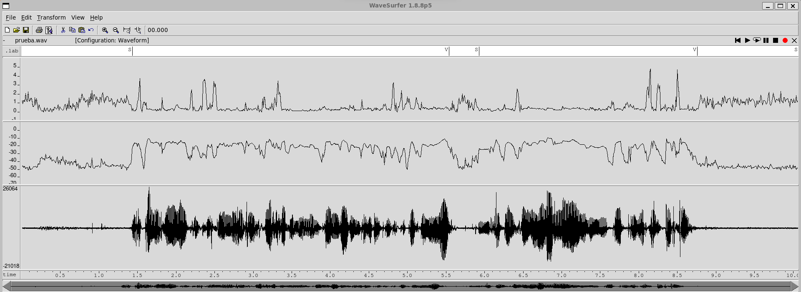
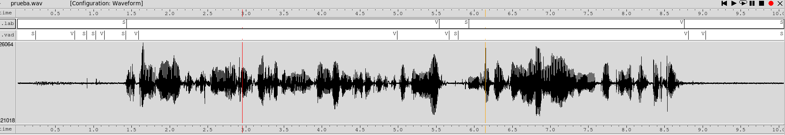
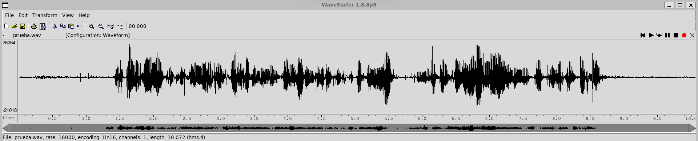
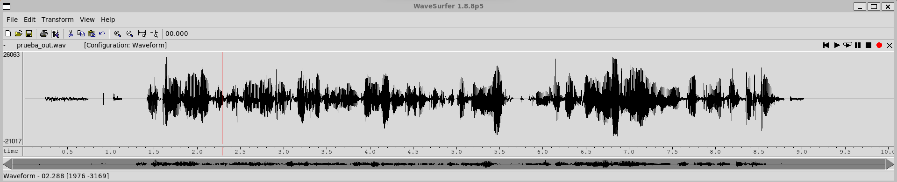
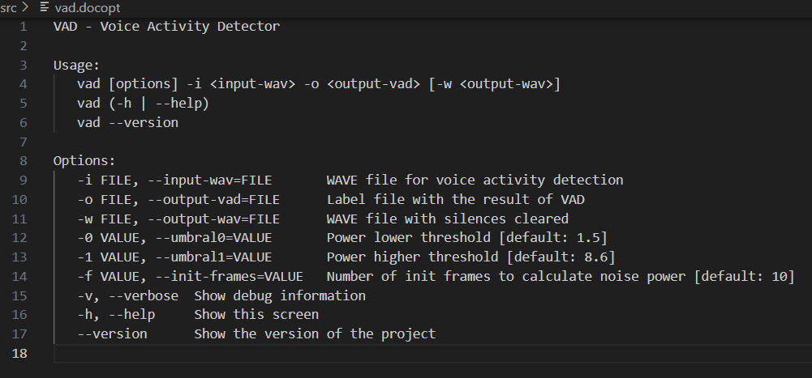

PAV - P2: detección de actividad vocal (VAD)
============================================

Esteve Torrens Segret Y Miquel Navarro Parera
---------------------------------------------


Esta práctica se distribuye a través del repositorio GitHub [Práctica 2](https://github.com/albino-pav/P2),
y una parte de su gestión se realizará mediante esta web de trabajo colaborativo.  Al contrario que Git,
GitHub se gestiona completamente desde un entorno gráfico bastante intuitivo. Además, está razonablemente
documentado, tanto internamente, mediante sus [Guías de GitHub](https://guides.github.com/), como
externamente, mediante infinidad de tutoriales, guías y vídeos disponibles gratuitamente en internet.


Inicialización del repositorio de la práctica.
----------------------------------------------

Para cargar los ficheros en su ordenador personal debe seguir los pasos siguientes:

*	Abra una cuenta GitHub para gestionar esta y el resto de prácticas del curso.
*	Cree un repositorio GitHub con el contenido inicial de la práctica (sólo debe hacerlo uno de los
	integrantes del grupo de laboratorio, cuya página GitHub actuará de repositorio central del grupo):
	-	Acceda la página de la [Práctica 2](https://github.com/albino-pav/P2).
	-	En la parte superior derecha encontrará el botón **`Fork`**. Apriételo y, después de unos segundos,
		se creará en su cuenta GitHub un proyecto con el mismo nombre (**P2**). Si ya tuviera uno con ese 
		nombre, se utilizará el nombre **P2-1**, y así sucesivamente.
*	Habilite al resto de miembros del grupo como *colaboradores* del proyecto; de este modo, podrán
	subir sus modificaciones al repositorio central:
	-	En la página principal del repositorio, en la pestaña **:gear:`Settings`**, escoja la opción 
		**Collaborators** y añada a su compañero de prácticas.
	-	Éste recibirá un email solicitándole confirmación. Una vez confirmado, tanto él como el
		propietario podrán gestionar el repositorio, por ejemplo: crear ramas en él o subir las
		modificaciones de su directorio local de trabajo al repositorio GitHub.
*	En la página principal del repositorio, localice el botón **Branch: master** y úselo para crear
	una rama nueva con los primeros apellidos de los integrantes del equipo de prácticas separados por
	guion (**fulano-mengano**).
*	Todos los miembros del grupo deben realizar su copia local en su ordenador personal.
	-	Copie la dirección de su copia del repositorio apretando en el botón **Clone or download**.
		Asegúrese de usar *Clone with HTTPS*.
	-	Abra una sesión de Bash en su ordenador personal y vaya al directorio **PAV**. Desde ahí, ejecute:

		```.sh
		git clone dirección-del-fork-de-la-práctica
		```

	-	Vaya al directorio de la práctica `cd P2`.

	-	Cambie a la rama **fulano-mengano** con la orden:

		```.sh
		git checkout fulano-mengano
		```

*	A partir de este momento, todos los miembros del grupo de prácticas pueden trabajar en su directorio
	local del modo habitual, usando el repositorio remoto en GitHub como repositorio central para el trabajo colaborativo
	de los distintos miembros del grupo de prácticas o como copia de seguridad.
	-	Puede *confirmar* versiones del proyecto en su directorio local con las órdenes siguientes:

		```.sh
		git add .
		git commit -m "Mensaje del commit"
		```

	-	Las versiones confirmadas, y sólo ellas, se almacenan en el repositorio y pueden ser accedidas en cualquier momento.

*	Para interactuar con el contenido remoto en GitHub es necesario que los cambios en el directorio local estén confirmados.

	-	Puede comprobar si el directorio está *limpio* (es decir, si la versión actual está confirmada) usando el comando
		`git status`.

	-	La versión actual del directorio local se sube al repositorio remoto con la orden:

		```.sh
		git push
		```

		*	Si el repositorio remoto contiene cambios no presentes en el directorio local, `git` puede negarse
			a subir el nuevo contenido.

			-	En ese caso, lo primero que deberemos hacer es incorporar los cambios presentes en el repositorio
				GitHub con la orden `git pull`.

			-	Es posible que, al hacer el `git pull` aparezcan *conflictos*; es decir, ficheros que se han modificado
				tanto en el directorio local como en el repositorio GitHub y que `git` no sabe cómo combinar.

			-	Los conflictos aparecen marcados con cadenas del estilo `>>>>`, `<<<<` y `====`. Los ficheros correspondientes
				deben ser editados para decidir qué versión preferimos conservar. Un editor avanzado, del estilo de Microsoft
				Visual Studio Code, puede resultar muy útil para localizar los conflictos y resolverlos.

			-	Tras resolver los conflictos, se ha de confirmar los cambios con `git commit` y ya estaremos en condiciones
				de subir la nueva versión a GitHub con el comando `git push`.


	-	Para bajar al directorio local el contenido del repositorio GitHub hay que ejecutar la orden:

		```.sh
		git pull
		```
	
		*	Si el repositorio local contiene cambios no presentes en el directorio remoto, `git` puede negarse a bajar
			el contenido de este último.

			-	La resolución de los posibles conflictos se realiza como se explica más arriba para
				la subida del contenido local con el comando `git push`.


*	Al final de la práctica, la rama **fulano-mengano** del repositorio GitHub servirá para remitir la
	práctica para su evaluación utilizando el mecanismo *pull request*.
	-	Vaya a la página principal de la copia del repositorio y asegúrese de estar en la rama
		**fulano-mengano**.
	-	Pulse en el botón **New pull request**, y siga las instrucciones de GitHub.


Entrega de la práctica.
-----------------------

Responda, en este mismo documento (README.md), los ejercicios indicados a continuación. Este documento es
un fichero de texto escrito con un formato denominado _**markdown**_. La principal característica de este
formato es que, manteniendo la legibilidad cuando se visualiza con herramientas en modo texto (`more`,
`less`, editores varios, ...), permite amplias posibilidades de visualización con formato en una amplia
gama de aplicaciones; muy notablemente, **GitHub**, **Doxygen** y **Facebook** (ciertamente, :eyes:).

En GitHub. cuando existe un fichero denominado README.md en el directorio raíz de un repositorio, se
interpreta y muestra al entrar en el repositorio.

Debe redactar las respuestas a los ejercicios usando Markdown. Puede encontrar información acerca de su
sintáxis en la página web [Sintaxis de Markdown](https://daringfireball.net/projects/markdown/syntax).
También puede consultar el documento adjunto [MARKDOWN.md](MARKDOWN.md), en el que se enumeran los
elementos más relevantes para completar la redacción de esta práctica.

Recuerde realizar el *pull request* una vez completada la práctica.

Ejercicios
----------

### Etiquetado manual de los segmentos de voz y silencio

- Etiquete manualmente los segmentos de voz y silencio del fichero grabado al efecto. Inserte, a 
  continuación, una captura de `wavesurfer` en la que se vea con claridad la señal temporal, el contorno de
  potencia y la tasa de cruces por cero, junto con el etiquetado manual de los segmentos.



- A la vista de la gráfica, indique qué valores considera adecuados para las magnitudes siguientes:

	* Incremento del nivel potencia en dB, respecto al nivel correspondiente al silencio inicial, para
	  estar seguros de que un segmento de señal se corresponde con voz.
	  
	__En el caso de la potencia, los segmentos de silencio y de voz se distinguen con bastante claridad a lo largo de toda la señal. Si usamos el audio proporcionado al inicio de la práctica, prueba.wav, podríamos fijar un umbral en -30 dB, ya que en toda la señal las partes de silencio no superan ese nivel. No obstante, aplicar siempre un único umbral no resulta la opción más adecuada. Por ello, hemos decidido calcular la media de las primeras tramas (que se suponen de silencio) para poder adaptar el estudio a cada señal de manera específica.__

	* Duración mínima razonable de los segmentos de voz y silencio.

	__En el archivo de tipo WAVE que se nos proporciona se han alargado algunas pausas entre frases, por lo que optamos por comparar los resultados con otro audio de la práctica 1. A partir de esta comparación, concluimos que los intervalos de silencio rara vez son inferiores a unos 0,3 s/0,4 s. En cambio, los segmentos de voz presentan una duración más variable, en función de la longitud de la palabra o frase pronunciada. En este caso concreto, el fragmento de voz más breve es de 2,8 s y el más largo de 4,1 s, tal y como se muestra en la imagen.__

	* ¿Es capaz de sacar alguna conclusión a partir de la evolución de la tasa de cruces por cero?

	__No podemos extraer una conclusión clara a partir de la evolución de la tasa de cruces por cero, aunque sí puede servir como apoyo a la hora de tomar alguna decisión. En los tramos sordos, la zcr suele situarse aproximadamente entre 0,5 y 1,5. Es importante remarcar que, justo al inicio de un segmento de voz (y en algunos casos al comenzar a articular una palabra), la zcr aumenta de forma notable, lo que puede generar confusión. Por ello, su utilidad se limita principalmente a refinar el comportamiento del autómata.__


### Desarrollo del detector de actividad vocal

----------------------------------------------

- Complete el código de los ficheros de la práctica para implementar un detector de actividad vocal en
  tiempo real tan exacto como sea posible. Tome como objetivo la maximización de la puntuación-F `TOTAL`.

__Al implementar el autómata con los cuatro estados, observamos que hemos alcanzado una precisión del 94,084% sobre el conjunto de señales de la base de datos.__
```bash
  **************** Summary ****************
  Recall V:477.40/495.55 96.34%   Precision V:477.40/516.54 92.42%   F-score V (2)  : 95.53%
  Recall S:282.04/321.17 87.81%   Precision S:282.04/300.18 93.96%   F-score S (1/2): 92.66%
  ===> TOTAL: 94.084%
```

- Inserte una gráfica en la que se vea con claridad la señal temporal, el etiquetado manual y la detección
  automática conseguida para el fichero grabado al efecto. 
  

- Explique, si existen. las discrepancias entre el etiquetado manual y la detección automática.

__En líneas generales el resultado coincide bastante, pero al comienzo del audio aparece un breve instante en el que, dentro de un silencio prolongado, el sistema marca presencia de voz. Se producen ligeros desajustes de precisión, tanto en el etiquetado manual como en la detección, de unos 0,05 s y casi imperceptibles, que se concentran justo en las transiciones entre zonas de voz y de silencio.__

__Queremos señalar que, a diferencia del etiquetado manual, la detección automática produce varias etiquetas consecutivas del mismo tipo de trama. Esto ocurre porque se han eliminado los glitches, es decir, esos cambios muy breves de voz a silencio y de silencio a voz.__

- Evalúe los resultados sobre la base de datos `db.v4` con el script `vad_evaluation.pl` e inserte a 
  continuación las tasas de sensibilidad (*recall*) y precisión para el conjunto de la base de datos (sólo
  el resumen).

  __Tal y como se ha indicado en el primer ejercicio, tras haber probado diferentes algoritmos en el autómata, el mejor resultado conseguido se ha conseguido implementando los cuatro estados.__

```bash
  **************** Summary ****************
  Recall V:477.40/495.55 96.34%   Precision V:477.40/516.54 92.42%   F-score V (2)  : 95.53%
  Recall S:282.04/321.17 87.81%   Precision S:282.04/300.18 93.96%   F-score S (1/2): 92.66%
  ===> TOTAL: 94.084%
```


### Trabajos de ampliación

#### Cancelación del ruido en los segmentos de silencio

- Si ha desarrollado el algoritmo para la cancelación de los segmentos de silencio, inserte una gráfica en
  la que se vea con claridad la señal antes y después de la cancelación (puede que `wavesurfer` no sea la
  mejor opción para esto, ya que no es capaz de visualizar varias señales al mismo tiempo).

  __En la siguiente imagen podemos observar la señal de audio original:__
  

  __Seguidamente, observamos la imagen con la señal de audio modificada añadiendo ceros en las tramas detectadas como silencios:__
  

  __Visualmente, podemos concluir que el autómata funciona correctamente, ya que en la mayoría de tramos de la señal original donde realmente había silencios se han modificado y ahora toman el valor de cero.__

  __Si utilizamos la señal modificada _prueba_out.wav_ con las tramas de silencio a cero, podemos volvemos a ejecutar el programa para generar un nuevo .vad. Si lo comparamos con el .lab de la señal original obtenemos un mejor resultado.__

  ```bash
  **************** prueba.lab ****************
  Recall V:  6.94/6.94  100.00%   Precision V:  6.94/8.24   84.22%   F-score V (2)  : 96.39%
  Recall S:  1.83/3.13   58.45%   Precision S:  1.83/1.83  100.00%   F-score S (1/2): 87.55%
  ===> prueba.lab: 91.864%
  ```

  ```bash
  **************** prueba.lab ****************
  Recall V:  6.94/6.94  100.00%   Precision V:  6.94/8.03   86.42%   F-score V (2)  : 96.95%
  Recall S:  2.04/3.13   65.19%   Precision S:  2.04/2.04  100.00%   F-score S (1/2): 90.35%
  ===> prueba.lab: 93.593%
  ```

  __Como se aprecia en el segundo resultado, que corresponde al obtenido con la señal modificada _prueba_out.wav_ con las tramas de silencio a cero, hemos obtenido un mejor resultado que con la señal original.__

#### Gestión de las opciones del programa usando `docopt_c`

- Si ha usado `docopt_c` para realizar la gestión de las opciones y argumentos del programa `vad`, inserte
  una captura de pantalla en la que se vea el mensaje de ayuda del programa.

   

__En el programa de ayuda se ha añadido la opción de introducir dos umbrales. _umbral0_ corresponde al valor máximo para que la voz pase a ser considerada como silencio, mientras que _umbral1_ es el mínimo valor para pasar de silencio a voz. Este valor lo hemos decidido poner en 8.6 ya que es el valor con el que mejor resultado hemos obtenido.__

__Además, hemos añadido la opción de elegir el número de tramas que se utilizan para obtener la potencia media del ruido de la señal.__

### Contribuciones adicionales y/o comentarios acerca de la práctica

----------------------------------------------

- Indique a continuación si ha realizado algún tipo de aportación suplementaria (algoritmos de detección o 
  parámetros alternativos, etc.).

- Si lo desea, puede realizar también algún comentario acerca de la realización de la práctica que
  considere de interés de cara a su evaluación.

  __Hemos decidido incluir el parámetro de la tasa de cruces por cero en la evaluación de la señal para conseguir un autómata más completo y preciso ya que en nuestra señal particular y otras estudiadas, la mejora es más perceptible.__


### Antes de entregar la práctica

Recuerde comprobar que el repositorio cuenta con los códigos correctos y en condiciones de ser 
correctamente compilados con la orden `meson bin; ninja -C bin`. El programa generado (`bin/vad`) será
el usado, sin más opciones, para realizar la evaluación *ciega* del sistema.
